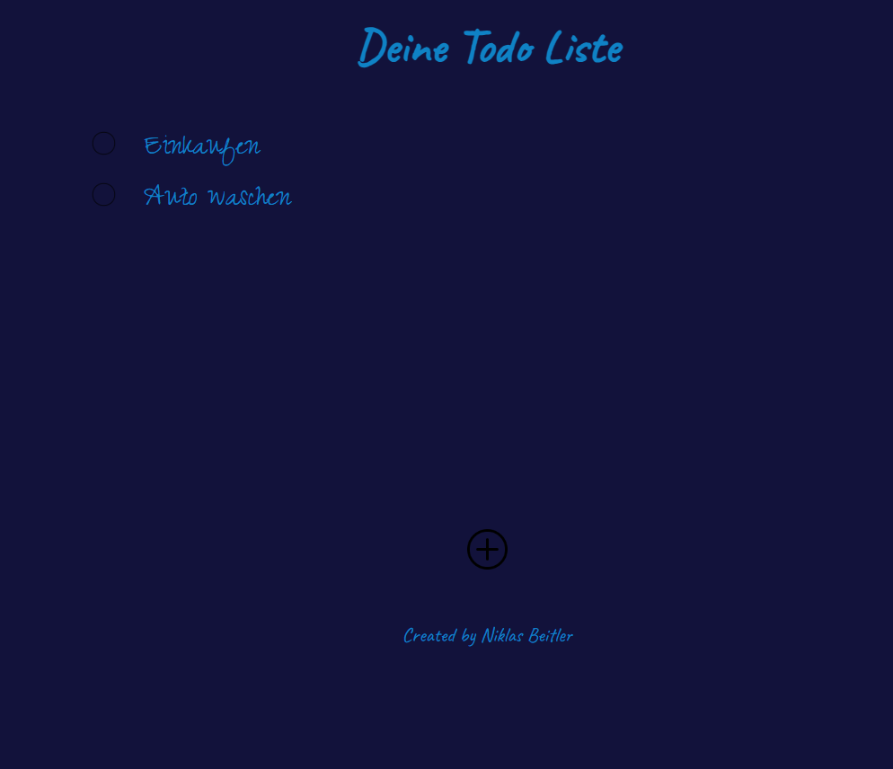

# Todo List

## Description

Todo List is a simple and intuitive application designed to help you organize your tasks and manage your daily activities efficiently. Whether you're planning your workday, organizing personal errands, or keeping track of project deadlines, Todo List has you covered.

## Features

**Task Management**: Easily add, edit, and delete tasks to keep your list up-to-date.

## How to Use

1. **Add Task**: Click the "Add Task" button and enter your task details.
2. **Edit Task**: Double-click on a task to edit its details.

## License

This application is distributed under the [MIT License](https://opensource.org/licenses/MIT). See the LICENSE file for more details.

**Note:** Stay organized and productive with Todo List!

